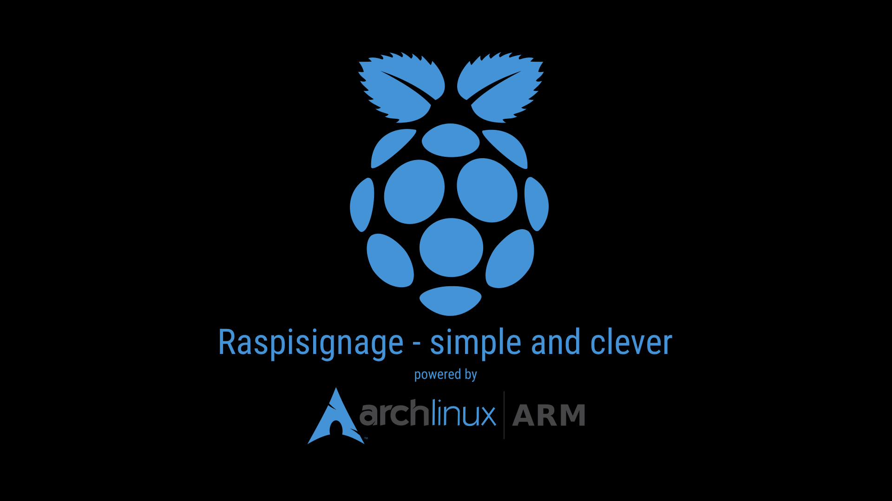

# Digital Signage with archlinux|ARM and Raspberry Pi

<p align="center"></p>

<!-- TOC -->

- [Digital Signage with archlinux|ARM and Raspberry Pi](#digital-signage-with-archlinuxarm-and-raspberry-pi)
    - [What is RaspiSignage?](#what-is-raspisignage)
    - [Prerequisites](#prerequisites)
    - [Preparing for a player setup (client)](#preparing-for-a-player-setup-client)
        - [00-a_client.conf](#00-a_clientconf)
        - [00-b_wpa_supplicant-wlan0.conf](#00-b_wpa_supplicant-wlan0conf)
        - [00-c_wlan0.conf](#00-c_wlan0conf)
        - [00-d_eth0.conf](#00-d_eth0conf)
    - [Preparing for a CMS/server setup (optional)](#preparing-for-a-cmsserver-setup-optional)
        - [00-zsrv_rootafterboot.bash](#00-zsrv_rootafterbootbash)
    - [Running the scripts to prepare the SD card (on your Linux box)](#running-the-scripts-to-prepare-the-sd-card-on-your-linux-box)
            - [Video 1](#video-1)
    - [Running scripts after first boot (on the Pi)](#running-scripts-after-first-boot-on-the-pi)
            - [Video 2](#video-2)
            - [Video 3](#video-3)
    - [Changing the URL the player shows](#changing-the-url-the-player-shows)
    - [Additional features/options](#additional-featuresoptions)
        - [Using Firefox with player](#using-firefox-with-player)
        - [Rerunning installation scripts on the PI](#rerunning-installation-scripts-on-the-pi)
        - [Backup entire system](#backup-entire-system)
        - [Restore/Clone entire system](#restoreclone-entire-system)
        - [Backup wordpress](#backup-wordpress)
        - [Ramdisk](#ramdisk)
        - [VNC server](#vnc-server)

<!-- /TOC -->
## What is RaspiSignage?

RaspiSignage is a set of scripts and configuration files to create a Digital Signage Player and/or a Digital Signage Server on a Raspberry Pi (Pi 3B+ or newer) using archlinux|ARM. Client and Server can but don't need to run on the same machine.

The player runs Firefox or Chromium on top of Fluxbox in full screen and displays the URL you specified.

The (optional) server is a LAMP stack running a wordpress blog with a set of plugins (mainly [Foyer](https://foyer.tv/) and [Theater](https://wp.theater/)) that provide the option to create

- Slides
- Channels
- Displays

Slides can be added to channels. Channels can be added to displays and displays have their unique URL which can then be played by our player. The main goal was to create an easy to manage Digital Signage solution where "normal" people can upload files and create content by just using the easy to understand Wordpress UI.

An enduser documentation (german) describing how to use the backend can be found in [documentation_DE/signage_de_endbenutzer_anleitung.md](documentation_DE/signage_de_endbenutzer_anleitung.md)

**You own the solution you build. No online services or subscriptions are involved!**


## Prerequisites

For the player or the server you need:

- a Raspberry Pi 3B+ or newer (512MB RAM is sufficient)
- 4GB SD card (or larger)

The setup has been tested on a RaspberryPi 3B+ with 512MB RAM and a RaspberryPi 4 with 1GB RAM.

## Preparing for a player setup (client)

Clone this repo to your Linux computer (will not work on Windows!) and `cd` into the subfolder `raspisignage`.

```
$ git clone https://github.com/boschkundendienst/raspisignage.git
Cloning into 'raspisigage'...
remote: Enumerating objects: 122, done.
remote: Counting objects: 100% (122/122), done.
remote: Compressing objects: 100% (102/102), done.
remote: Total 122 (delta 52), reused 73 (delta 19), pack-reused 0
Receiving objects: 100% (122/122), 6.82 MiB | 7.88 MiB/s, done.
Resolving deltas: 100% (52/52), done.
$ cd raspisignage
$ 
```

Then edit the configuration files

```
00-a_client.conf                       # main configuration file
00-b_wpa_supplicant-wlan0.conf         # to setup WiFi connection
00-c_wlan0.conf                        # IP settings for Wifi     (DHCP=default)
00-d_eth0.conf                         # IP settings for Ethernet (DHCP=default)
```

using your favorite editor.

### 00-a_client.conf

Before you edit this file, insert the SD card into your Linux machine and use the command `dmesg -w` to determine the device name. Names like `/dev/mmcblk` are often used if your machine has a built in SD card reader and the SD card is often named `/dev/sdX` if you use an external SD card reader.

The value is needed for `00-a_client.conf` to build the correct names to create and access **partition 1** and **partition 2** of the SD card. The combination of the variables `mydrive` and `mydrivesuff` in `00-a_client.conf` must reflect the name of the SD card device in your machine.

**Example 1 (SD card is `/dev/sde`)**

```
mydrive='/dev/sde'
mydrivesuff='' # 1 or 2 will be added automatically
```

will result in `/dev/sde1` and `/dev/sde2` which is correct to use this drive with the scripts.

**Example 2 (SD card is `/dev/mmcblk0`)**

```
mydrive='/dev/mmcblk0'
mydrivesuff='p' # 1 or 2 will be added automatically
```

will result in `/dev/mmcblk0p1` and `/dev/mmcblk0p2` which is correct to use this drive with the scripts.

The rest of the file `00-a_client.conf` is self explaining. The only other variables you should maybe change are the `myhostname` and the `myopenurl` variables. They will assign the hostname to your Raspberry Pi and set the URL that will be automatically opened by the player in full screen.

Here are all the default entries from `00-a_client.conf` which should work out of the box for a Raspberry Pi 4 located in Germany.

```
mydrive='/dev/mmcblk0'
mydrivesuff='p' # 'p' is needed for /dev/mmcblkX devices '' for /dev/sdX
mydlurl='http://os.archlinuxarm.org/os/ArchLinuxARM-rpi-4-latest.tar.gz'
myoutputfile='./ArchLinuxARM-rpi.tar.gz'
mykbdlayout='de-latin1-nodeadkeys'
myregion='Europe'
mycity='Berlin'
myhostname='signage01' # this is the hostname the Pi will get
myntps='0.de.pool.ntp.org server 1.de.pool.ntp.org server 2.de.pool.ntp.org server 3.de.pool.ntp.org'
mylang='de_DE.UTF-8'
mycoll='C'
mycs='de_DE'
mydisv6='y'
myenawifi='y'
myopenurl='https://chemnitzer.linux-tage.de/'
```

### 00-b_wpa_supplicant-wlan0.conf

If you don't need Wifi, you can skip editing this file. It is already prefilled with a sample `network{}` section. You have to add your own **Wifi SSID** and **Wifi Password** to the file.

The necessary network section can easily be generated with:

```
$ wpa_passphrase yourssid yourpassword
```

The command will create an output like this:

```
network={
	ssid="yourssid"
	#psk="yourpassword"
	psk=bd9abb43d0e2dd30bd92049f926debe09fc87c8eb18f1bdabe8e17453020bfa6
}
```

You could also use the [Raspberry Pi Wifi Config Generator](https://steveedson.co.uk/tools/wpa/), a cool online tool to generate the above network section.

Just add the section you created at the end of `00-b_wpa_supplicant-wlan0.conf` and the Pi will later automatically connect to your Wifi network.

For more information about the syntax take a look at the [ArchWiki (wpa_supplicant)](https://wiki.archlinux.org/index.php/Wpa_supplicant).

### 00-c_wlan0.conf

This file contains the IP settings for the built-in WiFi adapter. If you want to use DHCP or don't want to use Wifi you can leave it as is.

For more information about the possible configuration options take a look athe the [ArchWiki (systemd-networkd)](https://wiki.archlinux.org/index.php/Systemd-networkd#Wireless_adapter)

### 00-d_eth0.conf

This file contains the IP settings for the built-in LAN adapter. If you want to use DHCP or don't want to use Ethernet you can leave it as is.

For more information about the possible configuration options take a look at the the [ArchWiki (systemd-networkd)](https://wiki.archlinux.org/index.php/Systemd-networkd#Wired_adapter_using_DHCP)

If you just want to build a Digital Signage Player that opens the URL specified with `myopenurl` you can continue with the section **Running the installation scripts**

## Preparing for a CMS/server setup (optional)

For the server part (running a wordpress CMS standalone or besides the player) follow the instructions for the player but additionally also edit the file `00-zsrv_rootafterboot.bash`. This file will be copied to `/root/srv_rootafterboot.bash` to the Pi, so it is even possible to edit it later directly on the Pi if you currently don't know if the Pi should become a "server" or not.

### 00-zsrv_rootafterboot.bash

While the defaults should work out of the box, feel free to change the following variables at the beginning of the script `00-zsrv_rootafterboot.bash` to your needs:

```
db='dsdatabase'
dbuser='dswpuser'
dbpass='' # will be generated if not set
dbhost='localhost'
wptitle='dsserver'
wpadmin='dsadmin'
wpadminpass='' # will be generated if not set
wpadminemail='some@none.com'
wplocale='de_DE'
wppath='/srv/http'
```

**If you leave `dbpass` and `wpadminpass` empty, a password will be generated automatically when we manually execute this script later on the Pi. The created passwords will be displayed to you in the final setup message!**


## Running the scripts to prepare the SD card (on your Linux box)

**This part of the setup needs to be executed on your Linux box. It will not work on Windows and has been tested mainly using [archlinux](https://www.archlinux.org/) but should work with Ubuntu (18.04+ with bsdtar installed), too. It should also work on most other Linux distros. On Ubuntu 20.04 you have to install the package `libarchive-tools` to get bsdtar installed.**

After setting everything up in the configuration files we execute a set of scripts to automatically download archlinux|ARM, partition the SD card, write the rootfs to the SD card and preconfigure the system on the SD card. Execute the scripts in the following order:

```
$ ./01-download.bash
$ ./02-partitioning.bash
$ ./03-write-rootfs-to-sdcard.bash
$ ./04-preconfigure-system.bash
```

When the scripts are finished, you can remove the SD card from your computer and put it into your Raspberry Pi. Connect the PI to your TV using HDMI and power it up. It should startup and should be reachable via network. The built-in SSH server should be up and running, too. To find your PI on your network, the following command can help:

```
$ sudo nmap 192.168.178.0/24 -p 22 | grep -B 5 'Raspberry'
```

**replace 192.168.178.0/24 with the correct values for your network!**

#### Video 1

The following video shows the entire setup process until here:

<a href="https://asciinema.org/a/303013?autoplay=1&speed=3"></a>


## Running scripts after first boot (on the Pi)

Assuming your Pi is booted up and you are logged in as the user `alarm` either via SSH or locally using the default credentials:

**Default Credentials archlinux|ARM**

```
U: alarm
P: alarm

U: root
P: root
```

You should now see the following message:

```
Welcome to Arch Linux ARM

     Website: http://archlinuxarm.org
       Forum: http://archlinuxarm.org/forum
         IRC: #archlinux-arm on irc.Freenode.net
[alarm@signage01 ~]$ 
```

Become `root` by executing `su -` and use the default password `root`.

```
[alarm@signage01 ~]$ su -
Password: 
[root@signage01 ~]# 
```

You will automatically jump to **root**s home folder `/root` where we already placed the scripts `rootafterboot.bash` and `srv_rootafterboot.bash`.

Now execute either

```
rootafterboot.bash         # to make this machine a player
srv_rootafterboot.bash     # to make this machine a server with wordpress CMS
```

or both scripts if you want to place client and server on the same machine. If you have not yet configured the variables in `srv_rootafterboot.bash` you can also do that now.

#### Video 2

The execution of the script `rootafterboot.bash` which makes the Pi a DS player is shown in this video:

<a href="https://asciinema.org/a/303242?autoplay=1&speed=3"></a>

#### Video 3

The execution of the script `srv_rootafterboot.bash` which makes the Pi a DS Server (CMS) is shown in this video:

<a href="https://asciinema.org/a/303271?autoplay=1&speed=3"></a>


The script provided the credentials and URL to login to the Wordpress backend. Log in and continue with your setup using the Foyer plugin within Wordpress!

## Changing the URL the player shows

If you need to change the URL that the player shows with the full screen browser, just edit the file `/home/alarm/.fluxbox/startup` as the user `alarm` and change value of the variable `url` to the new `url`:

```
url='http://thenewurl.com/test'
```

**After the change** become **root** with `su -` and restart the browser with `systemctl restart lightdm`.

**Do never edit files in `/home/alarm` when you are the user `root` or you will mess up file and folder permissions!**

## Additional features/options

### Using Firefox with player

The default browser (viewer) for the player is [Chromium](https://www.chromium.org/Home) because it uses about 150MB less RAM than [Firefox](https://www.mozilla.org/firefox/). The setup is prepared to switch to Firefox very easily. You can either switch to Firefox before deploying to the SD card or afterwards directly on the Pi.

**before SD card preparation**

Search for the following section in `00-zrootafterboot.bash`

```
########################################################################
# START BROWSER
########################################################################
```

Change

```
# Chromium in kiosk mode with url (make sure there is an '&' at the end
/usr/bin/chromium --disable-breakpad --start-fullscreen --incognito --no-first-run --disable-session-crashed-bubble --temp-profile --disable-infobars --noerrdialogs --noerrors --kiosk \$url &
```

to

```
# Chromium in kiosk mode with url (make sure there is an '&' at the end
#/usr/bin/chromium --disable-breakpad --start-fullscreen --incognito --no-first-run --disable-session-crashed-bubble --temp-profile --disable-infobars --noerrdialogs --noerrors --kiosk \$url &
```

and accordingly change

```
########################################################################
# START BROWSER
########################################################################
# Firefox in kiosk mode with url (make sure there is an '&' at the end
# Firefox needs ~150MB more RAM
#/usr/lib/firefox/firefox --kiosk \$url &
```

to

```
########################################################################
# START BROWSER
########################################################################
# Firefox in kiosk mode with url (make sure there is an '&' at the end
# Firefox needs ~150MB more RAM
/usr/lib/firefox/firefox --kiosk \$url &
```

In a nutshell: "Disable the start of Chromium and enable start of Firefox."

**after SD card preparation**

If you want to switch to Firefox as the default viewer for the player after deploying the SD card you have to do it directly on the Pi (logged in locally or via SSH) as user `alarm`.

Open the file `/home/alarm/.fluxbox/startup` and make the same changes as described in **before SD card preparation**, just in a different file.

**After the change either reboot the Pi or execute `systemctl restart lightdm` as user `root` for the changes to take affect.**

### Rerunning installation scripts on the PI

**rootafterboot.bash**

You can at any time re-run this script on the Pi. It should make no problems.

**cleanup.bash**

This script is automatically generated during the execution of `srv_rootafterboot.bash`. It can be used to remove the entire wordpress database and delete all files and folders in webroot (as specified with `wppath` usually `/srv/http`). You can use it if you want to re-run `srv_rootafterboot.bash` and start with a total blank instance of wordpress. I used it a lot during my tests.

**srv_rootafterboot.bash**

You can at any time re-run this script on the Pi. Depending on your configuration it might re-generate the passwords for the database and Wordpress administrator but will show the changes after it ran. Your previous installation of wordpress should stay the same if you did not change any variables in `srv_rootafterboot.bash` since the first run.

### Backup entire system

Maybe you invested a lot of time in setting things up and you want to create a full backup of the installation on the Pi. While most documentations would encourage you to use `dd` and create a full disk image of the installation, we could go a much easier way.

1. Stop MariaDB service (if installed) with `systemctl stop mariadb`
2. Stop lightdm service (if installed) with `systemctl stop lightdm`
3. gzip the entire `/` folder to a remote host using SSH by excluding some special directories

Look at the following example to get a clue:

```
# remote    : 192.168.1.24
# remotefile: /home/pcfreak/p4-dsclient-backup.tar.gz

$ tar --exclude='/run/*' \ 
    --exclude='/dev/*' \ 
    --exclude='/sys/*' \
    --exclude='/tmp/*' \
    --exclude='/mnt/*' \
    --exclude='/proc/*' \
    --exclude='/media/*' \
    --exclude='/var/run/*' \
    --exclude='/var/lock/*' \
    --exclude='.gvfs' \
    --exclude='lost+found' \
    -zcvf - / | ssh user@192.168.1.24 'cat - > "/home/user/raspisignage/p4-dsclient-backup.tar.gz"'
```

### Restore/Clone entire system

The cool thing is, that you (as experienced Linux user) can now specify  `p4-dsclient-backup.tar.gz` as `myoutputfile` in `00-a_client.conf` and use only the scripts `02-partitioning.bash` and `03-write-rootfs-to-sdcard.bash` to create a clone of the SD card without using `dd`. That saves a lot of time to deploy your next player or server!

### Backup wordpress

During the wordpress installation the plugin [All in One WP Security & Firewall](https://wordpress.org/plugins/all-in-one-wp-security-and-firewall/) has been installed. You can access it from the wordpress admin interface. It has a ton of cool security settings and an option to backup the wordpress instance (including the database) locally or remote. Some additional minor tweaks to the system might be necessary for some features (like sending backups via email) to work.

### Ramdisk

The installation routine does some folder linkage to point most temporary folders Chromium or Firefox uses to `/dev/shm/chromium` or `/dev/shm/mozilla`. `/dev/shm` is the built in Linux RAMDisk. Using it speeds things up and avoids unnecessary writes to the SD card.

### VNC server

If you have no monitor available and want to test your setup remotely consider using a VNC server as described [here](README_VNC.md).
