# Benutzeranleitung Digital Signage

## Voraussetzungen

Wordpress mit Foyer Plugin für Digital Signage erreichbar per Browser. In dieser Anleitung ist die URL der Wordpress-Instanz http://pisignage/ .

## Anmelden am System

&Ouml;ffnen Sie die Seite http://pisignage/wp-admin mit einem Browser Ihrer Wahl und geben Sie den administrativen **Benutzernamen (1)** und das korrekte **Passwort (2)** ein. Im Anschluss dr&uuml;cken Sie den Knopf **Anmelden (3)**.

<p align="center">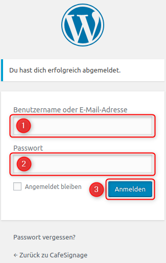</p>

## Mediendateien

### Mediendateien hochladen

Um gutaussehende Digital Signage Slides erstellen zu k&ouml;nnen, ben&ouml;tigt man in der Regel Mediendateien (Bilder, Videos oder PDF-Dateien), wenn m&ouml;glich mindestens in einer Aufl&ouml;sung, die der Aufl&ouml;sung des verwendeten Bildschirms (normalerweise FullHD 1920x1080) entsprechen.

Diese Dateien m&uuml;ssen zun&auml;chst auf das System hochgeladen werden.

Zum Hochladen von Dateien klicken Sie in der Wordpress Administrationsseite nacheinander auf die Men&uuml;punkte **Medien (1)** und **Datei hinzuf&uuml;gen (2)**.

<p align="center">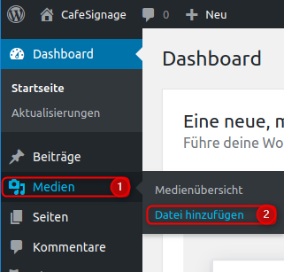</p>

Es erscheint die Seite zur Auswahl von Dateien. Klicken Sie auf den Knopf **Dateien ausw&auml;hlen (1)**. Links unten (gr&uuml;n) sehen Sie die maximal m&ouml;gliche Dateigr&ouml;&szlig;e die hochgeladen werden kann (in diesem Beispiel 250 MB).

<p align="center">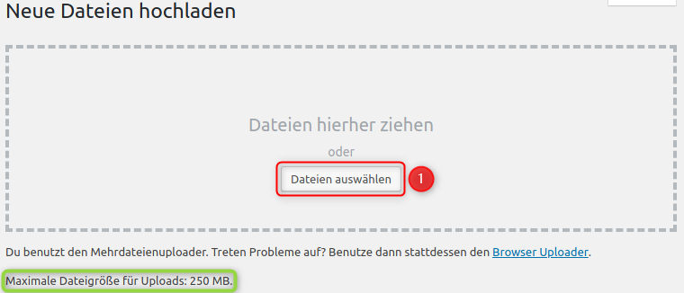</p>

Nun erscheint der Dialog Ihres Betriebssystems zur Auswahl von Dateien von der lokalen Festplatte. (Ihre Ansicht kann je nach Betriebssystem leicht unterschiedlich sein). W&auml;hlen Sie die gew&uuml;nschte Datei oder Dateien aus und klicken dann auf &Ouml;ffnen.

<p align="center">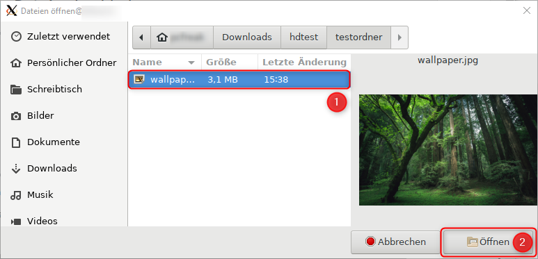</p>

Die Datei wird hochgeladen. Der Fortschrittsbalken zeigt den bereits durchgef&uuml;hrten prozentualen Upload an.

<p align="center"></p>

Wenn der Upload fertig ist, wird eine Vorschau der Mediendatei angezeigt.

<p align="center"></p>

### Mediendateien verwalten

Wenn Sie bereits hochgeladene Mediendateien verwalten wollen, klicken Sie in der Wordpress Administrationsseite nacheinander auf die Men&uuml;punkte **Medien (1)** und **Medien&uuml;bersicht (2)**.

<p align="center">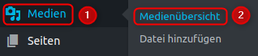</p>

Hier k&ouml;nnen Sie einzelne Dateien bzw. durch Nutzung des Knopfes **Mehrfachauswahl** mehrere Dateien ausw&auml;hlen. Je nach Auswahl erscheinen die selbsterkl&auml;renden Optionen zur **Beschriftung (1)** bzw. **L&ouml;schung (2)** von Dateien.

<p align="center">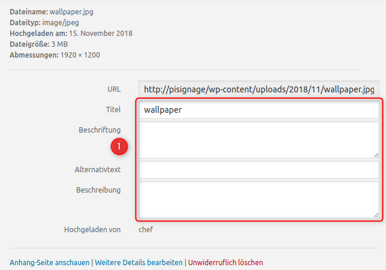&nbsp;&nbsp;&nbsp;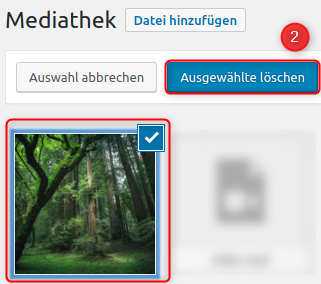</p>

## Foyer Plugin

Mit dem Digital Signage Plugin **Foyer** k&ouml;nnen wir Slides, Kan&auml;le und Displays erstellen. Das erstellte Display kann dann sp&auml;ter entweder direkt &uuml;ber den HDMI-Ausgang des Servers (z.B. RaspberryPi) oder in einem beliebigen anderen Browser (z.B. TV mit Browser-Funktion oder PC) durch Aufrufen der URL des erstellten Displays angezeigt werden.

F&uuml;r die Ersteinrichtung m&uuml;ssen wir die korrekte Reihenfolge einhalten, d.h. zuerst wird mindestens 1 Slide erstellt, da diese zu Kan&auml;len hinzugef&uuml;gt werden. Kan&auml;le wiederum sind notwendig, damit diese Displays zugewiesen werden k&ouml;nnen.

### Erstellen von Slides

W&auml;hlen Sie im Men&uuml; **Foyer (1)** die Option **Slides (A)**

<p align="center">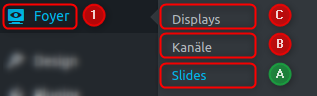</p>

und klicken dann links oben auf den Button Slides **Hinzuf&uuml;gen**.

<p align="center">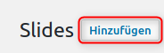</p>

Zum Zwecke dieser Anleitung w&auml;hlen wir nun die einfachste Form eines Slides, n&auml;mlich das Format **Standard (2)** und als Hintergrund den Typ **Bild (3)**.

<p align="center">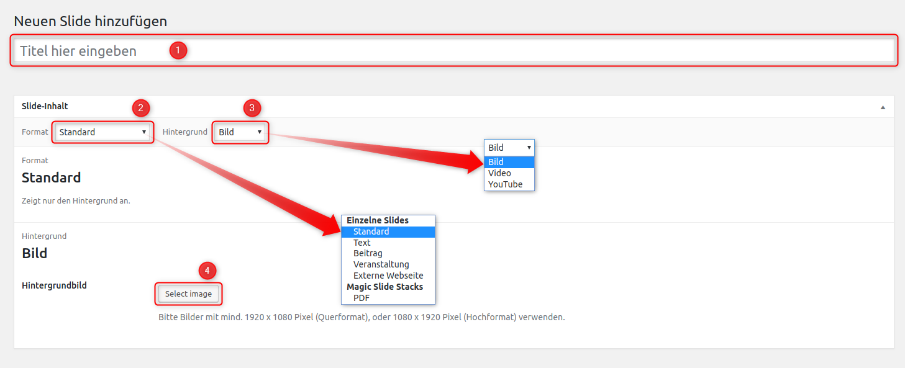</p>

Wenn Sie mit der Benutzeroberfl&auml;che von Wordpress, bzw. Foyer weiter vertraut sind, k&ouml;nnen Sie selbst andere Format-Typen wie Text, Beitrag, Veranstaltung, externe Webseite oder Magic Slide Stacks (PDF) erstellen.

Als Hintergrund kann z.B. anstatt einem Bild auch ein Video (lokal) oder von Youtube gesetzt werden.

Je nach Auswahl des Formats erscheinen andere Dialoge, z.B. zur Eingabe von Texten f&uuml;r den Beitragstype **Text** uvm.

Alle Optionen zu erkl&auml;ren w&uuml;rde den Rahmen dieser Anleitung sprengen, die verschiedenen Formate sind jedoch i. d. R. selbsterkl&auml;rend.

Geben Sie den gew&uuml;nschten Titel ein und w&auml;hlen Sie als Bild die vorher hochgeladene Mediendatei aus.

Im Anschluss haben Sie mehrere M&ouml;glichkeiten

- ( A ) Ver&ouml;ffentlichen     = Speichern und Ver&ouml;ffentlichen des Slides
- ( B ) Vorschau            = &Ouml;ffnet ein neues Browserfenster und zeigt eine minimierte Vorschau des Slides
- ( C ) Speichern           = Speichern des Slides ohne Ver&ouml;ffentlichung
- ( D ) Refresh foyer_slide = Forciert das Neuladen des Slides in evtl. bereits verbundenen Browsern innerhalb von ca. 120 Sekunden

<p align="center">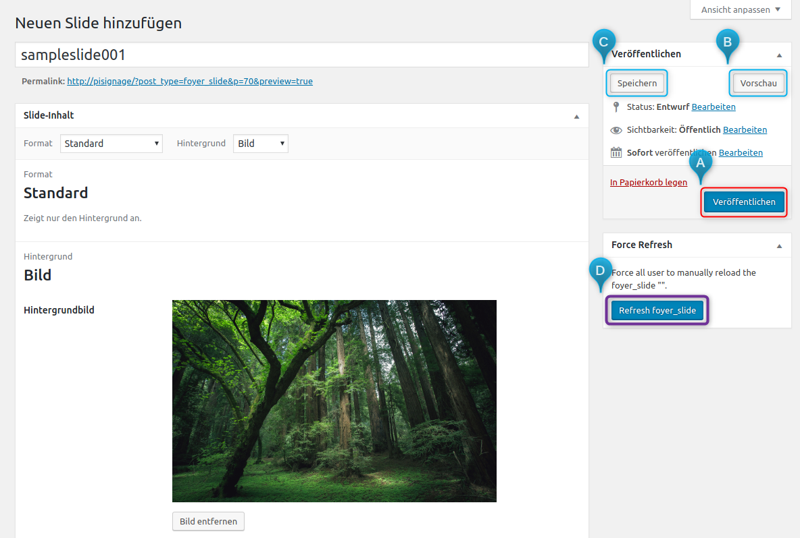</p>

Wir klicken auf **Ver&ouml;ffentlichen (A)** und haben somit unser erstes Slide erstellt und ver&ouml;ffentlicht.

<p align="center">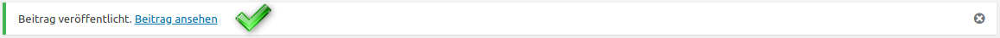</p>


### Erstellen von Kan&auml;len

W&auml;hlen Sie im Men&uuml; **Foyer (1)** die Option **Kan&auml;le (B)**

<p align="center">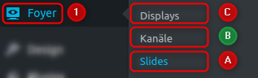</p>

und klicken dann links oben auf den Button Kan&auml;le **Hinzuf&uuml;gen**.

<p align="center">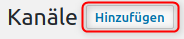</p>

Es erscheint ein neuer Dialog. Zum Zwecke dieser Anleitung legen wir nun einen **Titel (1)** fest und w&auml;hlen unser **Slide (2)** aus dem Dropdown Men&uuml; aus. Danach legen wir die **Dauer (3)** und den **&Uuml;bergang (4)** fest.

<p align="center">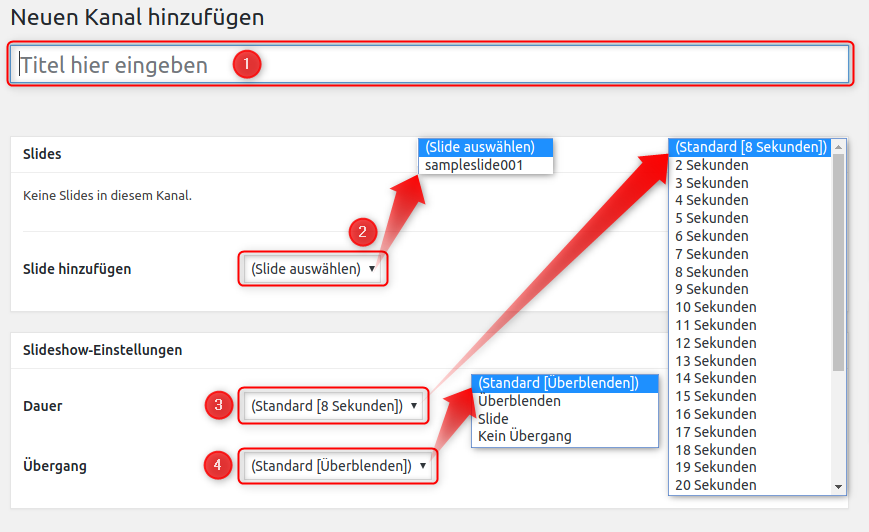</p>

Das Ergebnis k&ouml;nnte dann z.B. so aussehen und wir k&ouml;nnen den Kanal **Ver&ouml;ffentlichen**

<p align="center">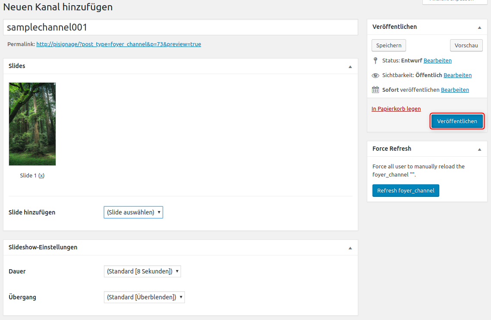</p>

<p align="center"></p>

Wir haben erfolgreich einen Foyer-Kanal erstellt.


### Erstellen von Displays

W&auml;hlen Sie im Men&uuml; **Foyer (1)** die Option **Displays (C)**

<p align="center">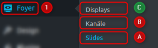</p>

und klicken dann links oben auf den Button Displays **Hinzuf&uuml;gen**.

<p align="center">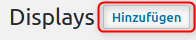</p>

Der Dialog zum Erstellen eines Displays erscheint.

Hier k&ouml;nnen Sie nun einen **Titel (1)** z.B. `sampledisplay001` eingeben, Ihren erstellten Kanal (`samplechannel001`) als **Standard-Kanal (2)** w&auml;hlen und *optional* einen **Tempor&auml;ren Kanal (3)** w&auml;hlen, welcher konfiguriert werden kann nur zu bestimmten Tagen bzw. Uhrzeiten als Ersatz f&uuml;r den Standard-Kanal zu laufen.

<p align="center">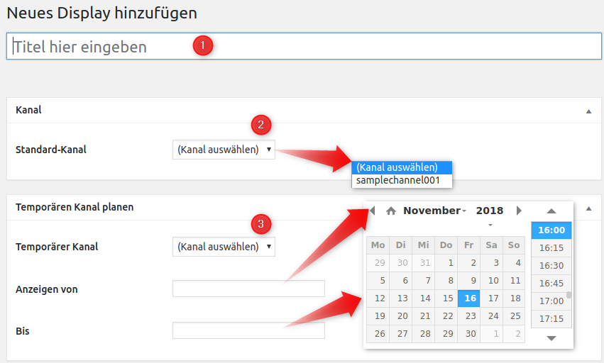</p>

Danach k&ouml;nnen Sie das Display **Ver&ouml;ffentlichen**.

<p align="center">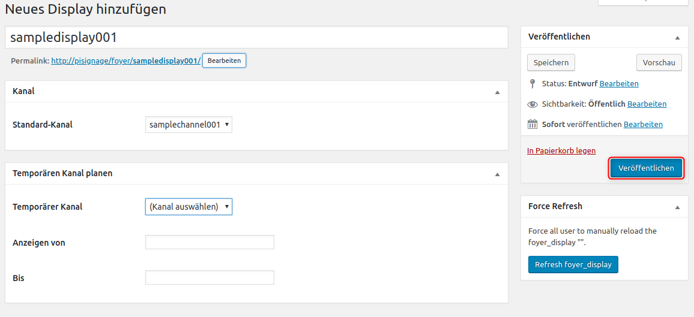</p>

<p align="center"></p>

### Display auf einem Bildschirm anzeigen

Alle von Ihnen konfigurierten Displays haben eine eindeutige URL (Webseite), welche nach folgender Logik aufgebaut ist:

```
http://<hostname>/?foyer_display=<displayname>
```

Wenn Ihr Display also `sampledisplay001` heisst und Ihre Digital Signage Installation unter `http://picomputer` eingerichtet ist, folgenderma&szlig;en:

```
http://picomputer/?foyer_display=sampledisplay001
```

Sie können die aktuelle URL eines Displays auch aus dem Web-Interface direkt kopieren/übernehmen.


## Zusammenfassung

In dieser Kurzanleitung haben Sie gelernt, wie Sie Slides, Kan&auml;le und Displays erstellen. Mit etwas &Uuml;bung werden Sie bald ein Digital Signage Profi werden!
